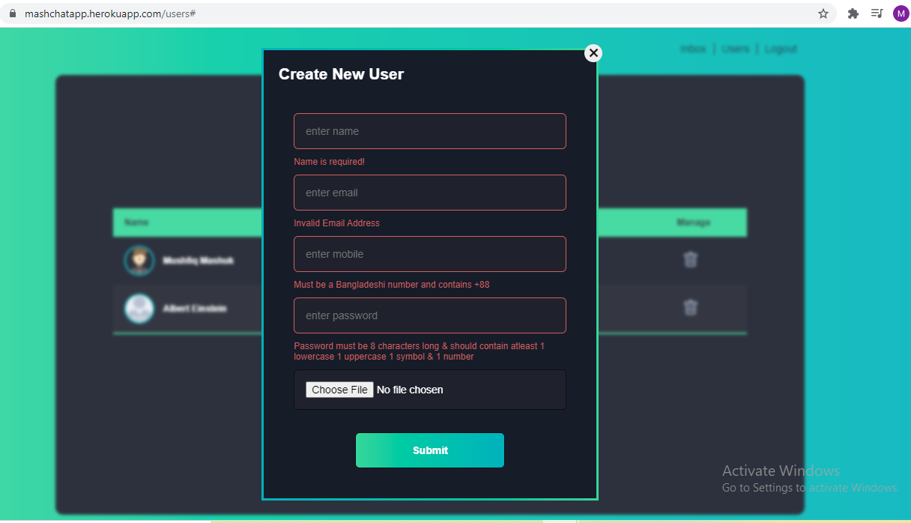
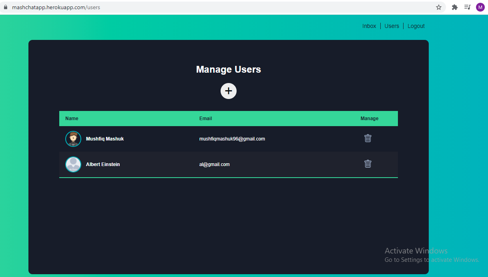
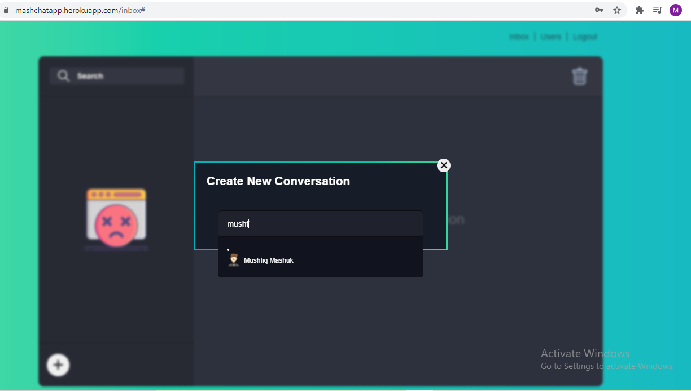
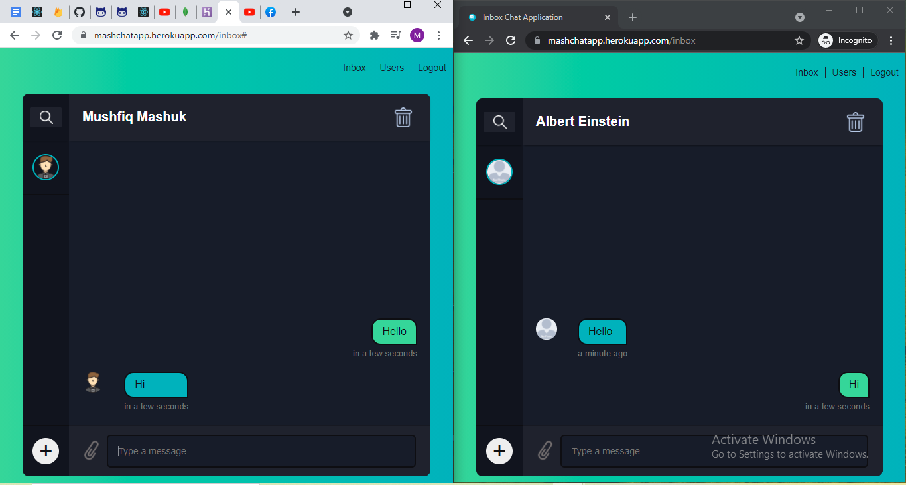

# Chat-Application

##### Admin login with email or phone: al@gmail.com, +8801711111111
##### Password: 12345aA7&

*** User can not create an account. Only an admin can add a user ***  

For live preview: https://mashchatapp.herokuapp.com/

                                                  Technologies and Purpose
I created this app for practicing my knowledge of Node.js. Key Technologies used in this app: 
1. Express JS (A node.js framework- allows us to write lesser code)
2. Socket.io (For live chat feature)
3. MongoDB database
4. Mongoose (A beautiful framework to use MongoDB, which allows us write database queries in our most beloved language- Javascript. Which is cool!)
5. EJS template engine

# Add User

# Admin Panel

# Create Conversation

# Real-time Chatting

